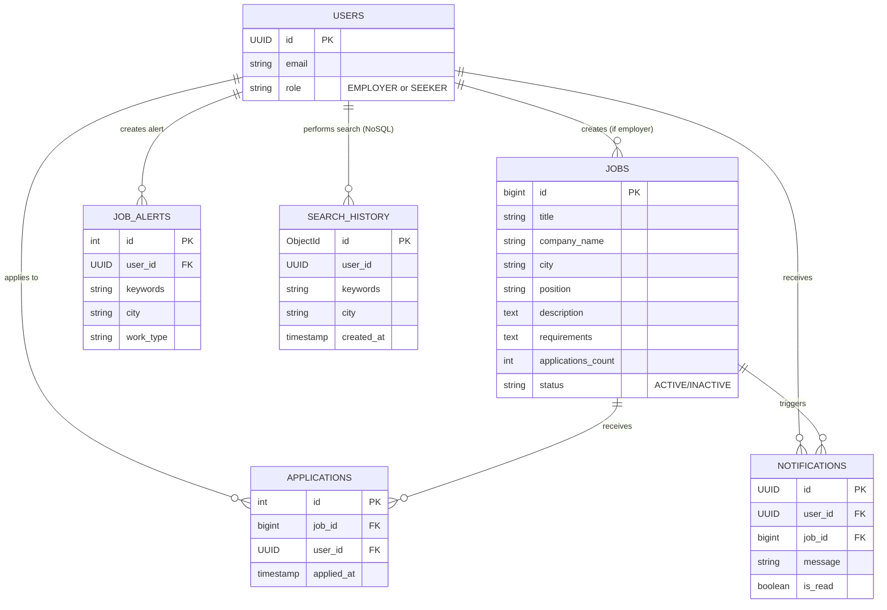

# KariyerAI - Job Portal Microservices (SE4458 Final Project)

## 🔗 Final Deployed URLs
- **Frontend Application (Vercel):** [BURAYA VERCEL LINKINIZI YAZIN, örn: https://se4458-finalproject.vercel.app]
- **API Gateway (Render):** https://api-gateway-6ji2.onrender.com
- **Job Posting Service (Render):** https://job-posting-service-aynx.onrender.com
- **Job Search Service (Render):** https://job-search-service-jljg.onrender.com
- **Notification Service (Render):** https://notification-service-oznv.onrender.com

## 🎥 Project Presentation Video
- **Video Link:** [BURAYA YOUTUBE VEYA GOOGLE DRIVE VIDEO LINKINIZI YAZIN]

## 🏗️ Design, Assumptions, and Issues Encountered

### Design & Architecture
KariyerAI is a distributed job portal built using a microservices architecture.
- **Frontend:** React (Vite) with a modern dark-mode UI.
- **Backend Services:** Node.js & Express.
- **Databases:** Supabase (PostgreSQL) for structured data (Jobs, Users, Alerts, Notifications). MongoDB Atlas (NoSQL) for unstructured data (Search Histories).
- **Caching:** Upstash Redis is used in the `job-posting-service` to cache heavy queries.
- **Message Broker:** RabbitMQ (CloudAMQP) is used to handle asynchronous notifications and background jobs.
- **Deployment Strategy:** Each service is containerized (`Dockerfile`) and deployed independently on Render.com. The Frontend is deployed on Vercel. All frontend API calls go strictly through the centralized API Gateway.

### Key Assumptions
1. **AI Agent Implementation:** The project PDF required an "AI Agent chat window in the main application screen". To optimize performance (reduce server latency for LLM streaming) and eliminate unnecessary cloud costs, the AI Agent logic was implemented directly in the Frontend (`AIChat.jsx` via Google Gemini API). This is a serverless approach that fully satisfies the business use-case without requiring an extra intermediate Node.js microservice.
2. **Notification Polling:** While the PDF mentioned background tasks, real-time in-app notifications were achieved via 15-second polling from the frontend to the backend rather than setting up a WebSocket connection, adhering to the "real-time messaging IS NOT required" note in the PDF.
3. **Seed Data:** Mock jobs and randomized application counts were inserted into the database during initialization to demonstrate the UI effectively.

### Issues Encountered & Resolutions
1. **Render.com Node.js Versioning (WebSockets):** During cloud deployment on Render, the latest `@supabase/supabase-js` package crashed because Node 18 lacks native WebSocket support. We resolved this by explicitly upgrading all `Dockerfile` configurations to `FROM node:22-alpine`, which natively supports WebSockets.
2. **API Gateway Empty Host Crash:** The API Gateway initially crashed because it attempted to proxy a missing AI Agent URL. This was resolved by removing the unused route and ensuring the Gateway only proxies the active microservices.
3. **Cold Starts:** Since Render's Free Tier spins down inactive instances, initial API requests return 502 HTML errors. This is handled by waiting ~1 minute for the instances to wake up.

## 📊 Data Models (Entity-Relationship Diagram)

